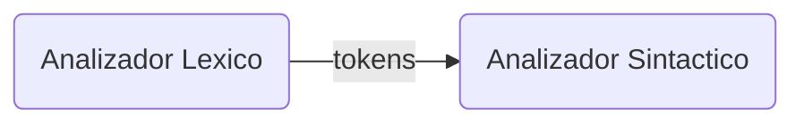

Links: [[Compiladores]]
___

# Introducción
Se estudiaran los analizadores sintácticos predictivos y recursivos

*Las tokens son frases gramaticales que deben ser parte de una gramatica libre de contexto (glc) *

Frase Gramatical = Sentencia
	Son solo elementos terminales.
- Estas sentencias forman parte del lenguaje que esta definiendo la gramática libre de contexto
- Esta gramática libre de contexto define la sintaxis del lenguaje y la estructura del programa

**El Analizador Sintáctico es un autómata de pila. El Analizador Léxico es un autómata finito determinista.**

___
- Se debe definir el tipo de GLC para que el analizador sintáctico haga un análisis descendente
- Hay 3 tipos de GLC adecuados para un ASD:
	1. [[Gramáticas S]] (simple)
	2. [[Gramáticas q]] (con producción $\epsilon$)
	3. [[Gramáticas LL (1)]]
