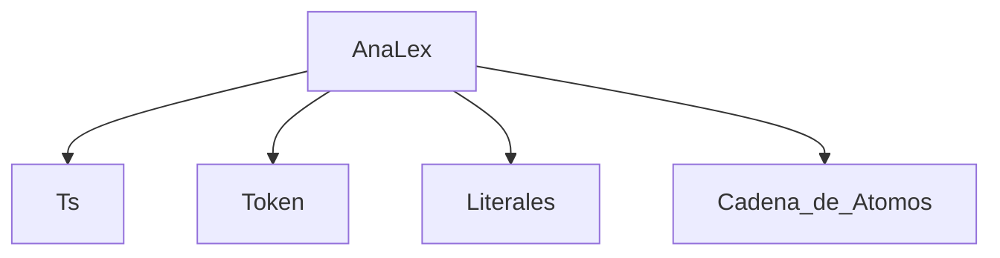

Links: [[Compiladores]]
___

```C
enteiro _funt (flutuador _cad1, enteiro _num1)
{
	enteiro _num2=15,_num3;
	_num2 += _num1;
	para _num3[0,5]
	#
		se(_num2<=25)
		#
			_num2 += 2;
		#
	#
	cad1 = cad1 & "amigos"
	retorno _num2;
}

assinado _principal()
{
	enteiro _valt = 15;
	flutuador _cadena = "hola";
	[_funt(_cadena, _valt1)]
}
```

Cadena de átomos del programa anterior:
ia(fa,ia){ia=n,a;axa;pa[n,n]#s(awn ... ...



___
# Ejemplo de una Función

\<TipoF> $\rightarrow$ \<Tipo>
\<TipoF> $\rightarrow$ g
\<Func> $\rightarrow$ \<TipoF>a(\<listArg>){\<cuerpo>}   C.S.={ ifg }

Es de tipo 4 el código a generar.
**Cuando se encuentre un error no se debe detener el programa. Se debe decir en que atomo se encontro el error**
```C
Func()
{
	if (car =='i'||car=='f'||car=='g')
	{
		TipoF();
		if(car == '1')
			car = getchar();
		else
			rechaza();
		if(car == '(')
			car = getchar();
		else
			rechaza();
		listArg();
		if(car == ')')
			car = getchar();
		else
			rechaza();
		if(car == '{')
			car = getchar();
		else
			rechaza();
		Cuerpo();
		if(car == '}')
			car = getchar();
		else
			rechaza();
		return;
	}
	else
	{
		rechaza(); //Error, en X atomo se esparaba una i, una f o una g
		return;
	}
} /*Fin Func*/
```

**SE HARAN 43 FUNCIONES, UNA PARA CADA NO-TERMINAL**
Calcular los conjuntos de seleccion para cada una