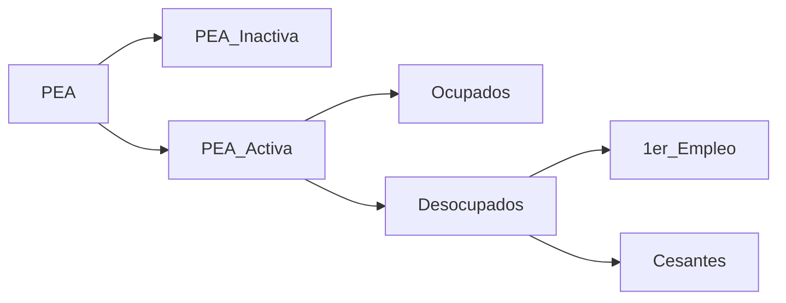

Links: [[Economía]]
___

El <mark class="hltr-pink">empleo</mark> se calcula mediante la <mark class="hltr-pink">tasa de ocupación</mark>, que nos indica la fracción de la población económicamente activa que cuenta con un empleo remunerado

El <mark class="hltr-pink">desempleo</mark>, mediante la <mark class="hltr-pink">tasa de desempleo</mark>, indica la fracción de la población económicamente activa que no puede encontrar un empleo, sea porque es su primer trabajo o ha sido despedida.

___
# Desempleo
- Un alto grado de desempleo causa la disminución de la producción real, disminución de la demanda y el aumento del déficit público
- <mark class="hltr-pink">Aumenta en la fase recesiva del ciclo económico</mark>, pues la demanda de personal en las empresas disminuye, la ciudadanía consume menos bienes, los precios bajan y los márgenes de ganancia se estrechan
- <mark class="hltr-pink">Disminuye significativamente en la fase expansiva del ciclo</mark>

____
# Tipos Desempleo
### Cíclico
- Se asocia a la fase del ciclo económico donde el trabajo no es suficiente para emplear
- Es difícil prever el momento en que remontará, y cuando habrá trabajos
### Estacional
- Ocurre en sectores que tienen una producción dependiente de la temporada
- Turismo de nieve, minoristas, hoteles en playa, etc.
### Estructural
- Desbalance entre oferta y demanda de empleo
- Cantidad de puestos de trabajo en algunos mandos es insuficiente para dar empleo
- Difícil de medir y poco sensible a políticas expansivas de demanda
- Debido a:
	- Factores demográficos o sociológicos (envejecimiento, embarazos)
	- Falta de calificación de la mano de obra por nuevas tecnologías, etc.
- Oferta < Demanda de trabajo
- Difícil de medir, poco sensible a políticas expansivas
- Se debe abordar la productividad, generando empleos

___
# Cálculos
### Tasa de ocupación
- Divide el número de personas ocupadas del país entre la totalidad de la población en edad de trabajar, multiplicando el resultado por 100
### Tasa de desempleo
- Divide el número de personas de la población desocupada de un país entre la población económicamente activa, multiplicando el resultado por 100
### Tasa natural de desempleo
- Siempre va a existir porque no quiere trabajar
- Indicador de paro hipotético que tendería una economía a largo plazo
- No es constante en el tiempo

___
# Clasificación PEA
**(Población Económicamente Activa)**

### PEA Inactiva
- Personas de 15 o más que no hicieron actividades económicas (en semana de encuesta) ni buscaron hacerlas (dos meses antes de encuesta)
- Estudiantes, personas dedicadas al quehacer domestico, pensionados por jubilación, de la tercera edad, con discapacidad
### PEA Activa
Personas de 15 o más que, al momento de la encuesta, hicieron una actividad económica o buscaron hacerlo
- **Desocupados**
	- Personas que estando dispuesta y en condiciones, no han encontrado un empleo debido a falta de escolaridad, experiencia, son considerados muy jóvenes o muy viejas, etc.
	- **Buscan 1er empleo**
		- No han trabajado ni han tenido un empleo, pero buscan
	- **Cesantes**
            - Personas desocupadas que dicen haber tenido un trabajo por dos semanas consecutivas
- **Ocupados**
	- Personas que trabajaron una hora o un día a cambio de una remuneración monetaria o en especie

 