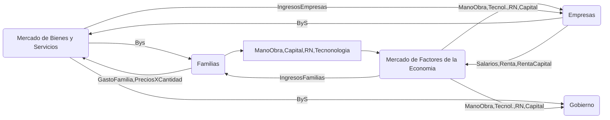

Links: [[Economía]], [[Base tributaria]]
___

# Conjunto de Medidas:
- Régimen tributaria ([[Base tributaria]])
- Gasto publico ([[Gasto e Inversion]])
- Endeudamiento interno (CETES) o externo del estado
- Operaciones y situación financiera de las entidades y organismos autónomos o paraestatales (PEMEX, CFE)

Estas medidas determinan el monto y distribución de la inversión y consumos publico.
- Buscan mejorar el gasto nacional, y por ende, aumentar el [[PIB]] a largo plazo

___
# Impuestos - Ingresos fiscales
Estos afectan el ingreso de las familias
- Esta política puede afectar o modificar los impuestos (ingresos fiscales)
- Inciden en el monto que la gente destina a la compra de bienes y servicios, así como en el ahorro
- El consumo y el ahorro privado tienen efectos importantes en la inversión y en la producción, tanto en corto como en largo plazo

____
# Gastos del Gobierno
- Los gastos del gobierno
	- Compras del gobierno
	- Transferencias gubernamentales
		- Incrementan el ingreso de sectores:
		- Pensiones
		- Becas a estudiantes
		- **Busca distribuir el ingreso en todos los sectores**

- El gasto del gobierno:
	- Determina el tamaño relativo de los sectores publico y privado
	- Afecta al nivel global de gasto en la economía, por lo que influye en el [[PIB]]

___

___
