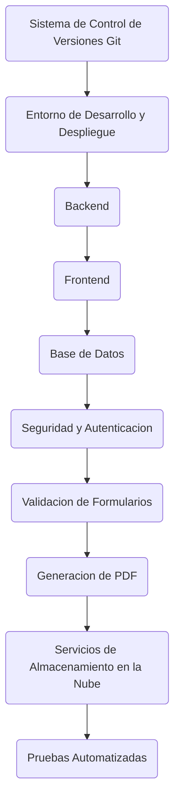

Links: [[Inteligencia Artificial]]
___

Es un algoritmo supervisado de clasificación y regresión

- Cada nodo interno es una prueba sobre un atributo
	- Cada nodo interno tiene una regla de decision que divide los datos
- Cada rama representa un resultado de la prueba
- Cada nodo hoja (nodo terminal) contiene una etiqueta de clase
- Se puede traducir en reglas
- Es fácil de comprender

___

> [!done] Sobreentrenamiento: Permite incluir todos los datos de entrenamiento

- La evaluacion de los datos de entrenamiento es alta
	- La etapa de prueba falla
- Para evaluar la clasificacion se usa la matriz de confusion
Clases obtenidas \\ Clases esperadas

|     | A              | B              |
| --- | -------------- | -------------- |
| P   | True Positive  | False Negative | 
| N   | False Positive | True Negative  |

___
- Al inicio todos los ejemplos estan en la raiz
- Particiones de manera recursiva de acuerdo a la seleccion de atributos
- Elimina ramas que pueden dificultar el entrenamiento y provoquen errores en la clasificacion
- Division recursiva de los datos de entrenamiento en subconjuntos
  Revisa criterio de parada:
	- Profundidad maxima del arbol
	- Numero minimo de muestras para dividir un nodo
	- No hay mas atributos

___
# Como se evaluan las caracteristicas

Metrica de division de atributos: Nivel de impureza o aleatoriedad en los subconjuntos
- Entopia
- Indice Gini (clases binarias)
	(Se busca minimizar)

Un nodo se convierte en hoja si tienen sus datos la misma clase
Sino seleccionar el atributo que mejor separe la muestra las clases, el atributo es nodo prueba
Entre mas impuroo requiere mas atributos para describir
Nodo inicial es mas impuro

___
# Entropía

$$Entropia = -plog_2\space p-qlog_2\space q$$
Ganancia = 1 - Entropía

Totalmente puro $\rightarrow$ Entropía 0
Impuro $\rightarrow$ Entropía [0 ... 1]

p: positivos
q: negativos

___
# Índice Gini

$$Gini = 1-\sum^n_{i=1}(p_i)^2$$

