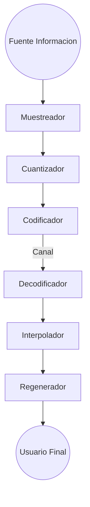

Links: [[Sistemas de Comunicaciones]]
___

- Todas las señales en el ambiente son analógicas, son continuas
- En sistemas computacionales se manejan señales discretas

- Para realizar una conversión de una señal continua a una discreta, se debe hacer un muestreo
	- El problema es que el **muestreo** refiere a una **perdida de información**
- Para hacer el **muestreo** se hace una medición cada cierto tiempo para hacer una representación como un pulso
	- Pero es necesario saber que cantidad de muestras se harán, lo que tiene varias implicaciones

- Como los sistemas digitales no conocen valores decimales, como el voltaje 8.3, por lo que se deben obtener estos valores en enteros, por lo que se hace la:
- **Cuantización:** Dividir en niveles de voltaje el eje vertical

- Una vez se tiene la señal dividida de en muestras y en niveles de voltaje enteros, es necesario convertir estos valores a binario, por lo que se hace:
- **Codificación**: Pasar valores decimales a binarios

De ahí se muestran los pasos de transformación de una señal analógica a digital:
1. **[[Muestreo]]**
2. **[[Cuantización]]**
3. **[[Codificación]]**
___
## Modelo de un Sistema de Comunicaciones Digital
- Muestreados

Conversor Analogico Digital ->  (Transmisor)
Conversor Digital Analogico -> Decodificador, Interpolador, Regenerador (Receptor)