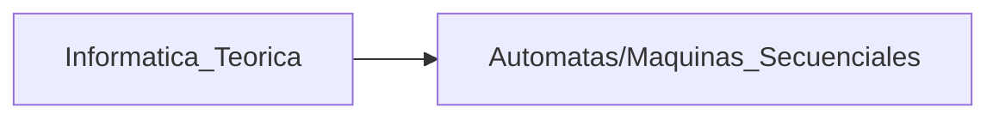
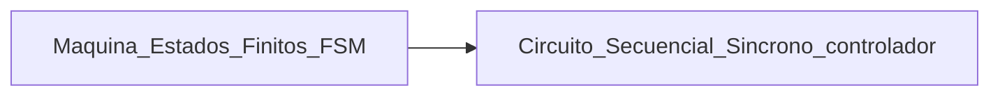

Links: [[VLSI]], [[Modelo de Mealy]], [[Modelo de Moore]], [[Modelo de Medvedev]]
___

# Autómata:

- Describe de manera formal el funcionamiento de un sistema
- Es un modelo abstracto de una computadora digital
    - Entrada - lee símbolos
    - Salida - Produce símbolos
    - Unidad de control que tiene estado interno
    - Cambia el estado interno de acuerdo

___
Desde el punto de vista de la electrónica digital

___
# Combinacional vs. Secuencial

- Combinacionales
	- No tienen memoria
- Secuenciales
    - Tienen memoria
    - La información almacenada constituye el estado interno del sistema

___
# Secuencial

- Esta formado por un bloque combinacional y un bloque de memoria
- Dependiendo como se interconectan y sus características, existen distintos modelos de circuitos secuenciales
- La retroalimentación (diagrama) es lo que genera memoria, aunque no se tenga un bloque especifico

## Tipos

- Síncronos
    - Su comportamiento se define por la señal de reloj en instantes de tiempo
    - Esta señal es un tren de pulsos, normalmente cuadrada
    - Se utiliza el flanco de subida (pasa de 0 a 1) o de bajada (pasa de 1 a 0). Solo se usa uno
- Asíncronos
    - Su comportamiento se define por el orden en que cambian sus entradas, no hay una señal de reloj

___
# Secuenciales Síncronos

- Son el dispositivo electrónico digital que en la actualidad tienen mas presencia
- Hay varios modelos para estudiarlos, que dependen de la manera en que se interconectan sus elementos

### [[Modelo de Mealy]]
### [[Modelo de Moore]]
### [[Modelo de Medvedev]]
___

>[!done] Las diferencias entra los modelos de los secuenciales síncronos están en las entradas del bloque de salida

