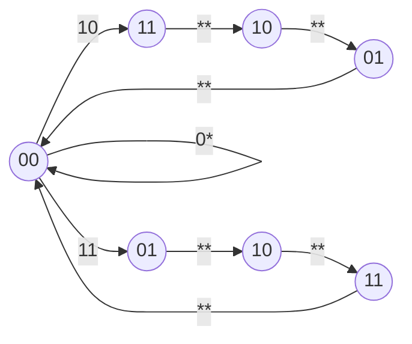
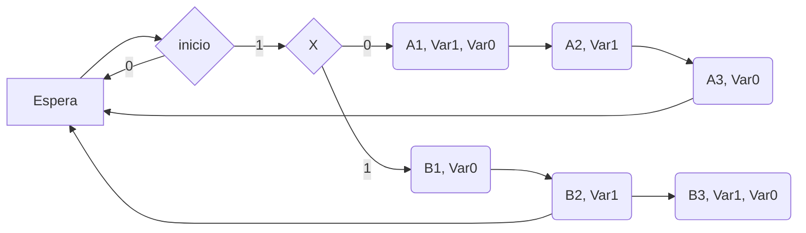

Links: [[VLSI]]
___

ASM - Algorithm State Machine

Tipo de diagrama de flujo que representa al algoritmo que determina el funcionamiento de una maquina de estados

___
# Elementos Básicos

1. **Bloque de Estado**
	- Se representa con un rectángulo
	- Llevan nombre y codificación en binario
	- Representa un estado
	- Se identifican las salidas no condicionales activas
	- En diseño RTL: se pueden asignar valores a registros
2. **Bloque de Salida Condicional**
	- Se representa con un ovalo
	- Identifican las salidas condicionales activas
	- No constituyen un estado, forman parte del estado inmediato anterior
	- Complementan a un estado, por eso no llevan nombre ni código
3. **Bloque de Decision**
	- Se representan con un rombo, con dos salidas (*0 y 1*)
	- No son un estado, forman parte del estado inmediato anterior
	- En diseño RTL: evalúan condiciones

___
### Ejemplo
**Diseñar la carta ASM para una maquina de estados que cuando reciba la señal INICIO genere una secuencia, la cual depende de la entrada X
Si    X = 0:  11, 10, 01
      X = 1:  01, 10, 11**

Entradas: 2 (inicio, X)
Salidas: 2 (Var1, Var0)
Estados:
Modelo: Moore

____

Es posible identificar el modelo usado en una cartas ASM si contiene bloques de salida condicional.
El modelo Mealy contiene salidas condicionales, en Moore no.

