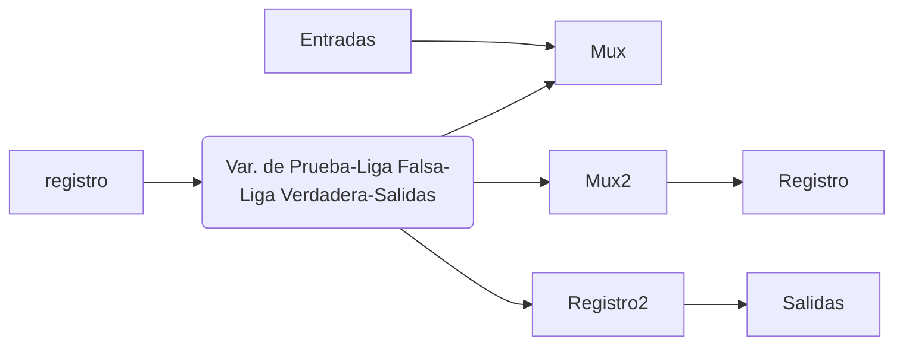

Links: [[VLSI]]
___

Los diseños basados en memorias se distinguen por tener ciertas arquitecturas que no dependen del sistema, sino que cuentan con una estructura fija, y su comportamiento depende de la programación de las memorias

No es necesario re-alambrar el circuito para un comportamiento diferente

> [!done] Maquinas de Estados cuyo comportamiento es "programado"

___
# Métodos de Diseño Basados en Memoria

1. Direccionamiento por Trayectoria
2. Direccionamiento Entrada-Estado
3. Direccionamiento Implícito
4. Direccionamiento con Secuenciadores
5. Direccionamiento de formato variable

___
# Direccionamiento por Trayectoria

La parte **Liga** de la **Memoria** representa el codigo de Estados

Se inicia el proceso de diseño igual que en el método tradicional. Obteniendo la tabla de transiciones se termina el diseño
$$\text{Tabla de Transiciones} \rightarrow \text{Tabla de Programacion de la Memoria}$$
### Ejemplo. Carta ASM
Entradas: 3 (Q1, Q2, Q3)
Salidas: 4 (S1, S2, S3, S4)
Estados: 4

La memoria sera siempre de tipo D
Su tamaño sera de: 2 bits

**Tabla de Transiciones**
La tabla tendrá 32 variaciones $2^ 5 = 32$. (2 Estados + 3 Entradas)

La dirección de memoria se accede mediante la combinación de bits de *E1 E0 Q1 Q2 Q3*
La palabra de memoria (Dato) es la combinación de bits *E1+ E0+ S1 S2 S3 S4*

>[!done] El tamaño de memoria se especifica mediante un producto de dos numeros.                          (Numero de palabras de memoria) \* (Tamaño de palabra de memoria) $\rightarrow$ 32*6

| Edo. Presente | Entradas | Edo. Sig. | Salidas     | Señales de Activación               |
| ------------- | -------- | --------- | ----------- | ----------------------------------- |
| E1  E0        | Q1 Q2 Q3 | E1+ E0+   | S1 S2 S3 S4 | Las mismas que Edo. Sig. por tipo D |
| 00            | 000      | 00        | 1000        |                                     |
| 00            | 001      | 00        | 1000        |                                     |
| 00            | 010      | 11        | 1000        |                                     |
| 00            | 011      | 11        | 1000        |                                     |
| 00            | 100      | 01        | 1000        |                                     |
| 00            | 101      | 01        | 1000        |                                     |
| 00            | 110      | 01        | 1000        |                                     |
| 00            | 111      | 01        | 1000        |                                     |
|               |          |           |             |                                     |
| 01            | 000      | 10        | 0011        |                                     |
| 01            | 001      | 00        | 0101        |                                     |
| 01            | 010      | 10        | 0011        |                                     |
| 01            | 011      | 00        | 0101        |                                     |
| 01            | 100      | 10        | 0011        |                                     |
| 01            | 101      | 00        | 0101        |                                     |
| 01            | 110      | 10        | 0011        |                                     |
| 01            | 111      | 00        | 0101        |                                     |
|               |          |           |             |                                     |
| 10            | 000      | 00        | 0110        |                                     |
| 10            | 001      | 00        | 0110        |                                     |
| 10            | 010      | 00        | 0110        |                                     |
| 10            | 011      | 00        | 0110        |                                     |
| 10            | 100      | 00        | 0110        |                                     |
| 10            | 101      | 00        | 0110        |                                     |
| 10            | 110      | 00        | 0110        |                                     |
| 10            | 111      | 00        | 0110        |                                     |
|               |          |           |             |                                     |
| 11            | 000      | 00        | 0100        |                                     |
| 11            | 001      | 00        | 0100        |                                     |
| 11            | 010      | 00        | 0100        |                                     |
| 11            | 011      | 00        | 0100        |                                     |
| 11            | 100      | 00        | 0100        |                                     |
| 11            | 101      | 00        | 0100        |                                     |
| 11            | 110      | 00        | 0100        |                                     |
| 11            | 111      | 00        | 0100        |                                     |

**Comparación Memoria vs. Tradicional** 

 - En el método tradicional es difícil hacer modificaciones. En este es mucho mas sencillo
 - Este método utiliza menos componentes
 - Se ahorra mucho tiempo de diseño en este método

- Los limites de la memoria son fijos
- La memoria es costosa en comparación a las compuertas básicas

___
# Direccionamiento Entrada-Estado

Esto significa que para lograr un 1% adicional de efectividad, el tratamiento A cuesta $4000 mas que el tratamiento B

___
**Caracteristicas de este Direccionamiento**
- Hay que codificar cada variable por el uso de multiplexor, trabajo adicional
- Solamente se puede evaluar una variable de entrada por estado
- Por claridad, se recomienda tener una variable auxiliar cuando no se evalúa una variable de entrada
- No permite salidas condicionales (al menos en su estructura básica)

**Ejemplo Carta ASM**

| Variable | Codigo |     |
| -------- | ------ | --- |
| Aux      | 00     |     |
| Q1       | 01     |     |
| Q2       | 10     |     |
| Q3       | 11     |     | 

| Estado | Variable de Prueba | Liga Falsa | Liga Verdadera | Salidas |
| ------ | ------------------ | ---------- | -------------- | ------- |
| 000    | 10                 | 001        | 011            | 11000   |
| 001    | 00                 | 010        | 010            | 01001   |
| 010    | 11                 | 001        | 100            | 00110   |
| 011    | 01                 | 010        | 100            | 00100   |
| 100    | 00                 | 000        | 000            | 01010   | 

Ahora nuestra tabla de programación no es la tabla de transicion, como en el ejemplo anterior, sino qu esta nueva tabla.
- Por cada estado se tiene una linea de programacion
- Esta condicionada a trabajar con el modelo de Moore
- Desventaja: Solo se puede verificar una variable a la vez, una entrada a la vez
	- Solo se puede verificar una entrada por estado
	- Se tiene un tamaño de palabra mayor, lo que hace que necesitemos dos memorias para poder almacenar los 13 bits en 2 memorias de 8 bits

___
# Direccionamiento Implícito

| V/F | Q   | Incrementa | Carga |
| --- | --- | ---------- | ----- |
| 0   | 0   | 0          | 1     |
| 0   | 1   | 1          | 0     |
| 1   | 0   | 1          | 0     |
| 1   | 1   | 0          | 1      |

El valor V/F indica que valor debe de haber en la variable de entrada para hacer un salto

**Caracteristicas**
- Utiliza solo un campo de liga
- La variable de prueba determina si hay un salto o sigue secuencialmente
- Solo se puede evaluar una variable de entrada oír estado
- Hay que codificar cada variable de entrada
- Se debe poner una variable auxiliar para cuando no se evalúa una variable de entrada
- El valor de la variable auxiliar es arbitrario, pero debe ser conocido e invariante

**Ejemplo Carta ASM**

| Estados | Variable de Prueba | VF  | Liga | Salidas |
| ------- | ------------------ | --- | ---- | ------- |
| ---     | ---                | --- | ---  | ---     |
| 000     | 10                 | 1   | 010  | 11000   |
| 001     | 00                 | 1   | 011  | 01001   |
| 010     | 01                 | 1   | 101  | 00100   |
| 011     | 00                 | 0   | ***  | 00110   |
| 100     | 11                 | 0   | 001  | 10000   |
| 101     | 00                 | 0   | ***  | 01010   |
| 110     | 00                 | 1   | 000  | 00100   | 

- Con este metodo, se logra reducir el tamano de la palabra de bits
- Es forzoza la variable auxiliar para compararla y obtener el valor de VF
- Implica mas trabajo para que se cumpla la condicion del consecutivo
- Mismas deventajas que el direccionamiento entrada-estado

___
# Direccionamiento con Secuenciadores

Surgen como modificación a la arquitectura definida del direccionamiento implícito

Un secuenciador es la unidad base, la unidad de control de un microprocesador

Este método conserva las características funcionales de un direccionamiento implícito, pero se busca darle mayor funcionalidad para simplificar la maquina de estados al facilitar el manejo de ciclos, subrutinas, etc.
La funcionalidad agregada depende de las instrucciones que reconozca el secuenciador

### Ejemplo. Secuenciador de 4 instrucciones
Reconoce las siguientes cuatro instrucciones:

1. Continua (C) [00] - Pasa a la instrucción siguiente almacenada en el registro $\mu$PC
2. Salto Condicional (SC) [01] - Verifica la senal CC: 
	- 0 - salta al estado almacenado en PL
	- 1 - continua al estado N+1
3. Salto de Transformación [10] - El estado siguiente es el almacenado en MAP
	- En el bloque de decision no se coloca una variable, ya que el estado al que se ira esta almacenado en un registro
4. Salto Condicional usando la Direccion de Interrupciones (SCI) [11] - Verifica la senal CC:
	- 0 - salta al estado almacenado en Vect
	- 1 - continua al estado N+1

Debido a que se codificaran en memoria, se deben codificar las instrucciones para identificarlas en bits

## Características del método
- El tamano de la palabra es mayor, por lo que es mas costoso
- 