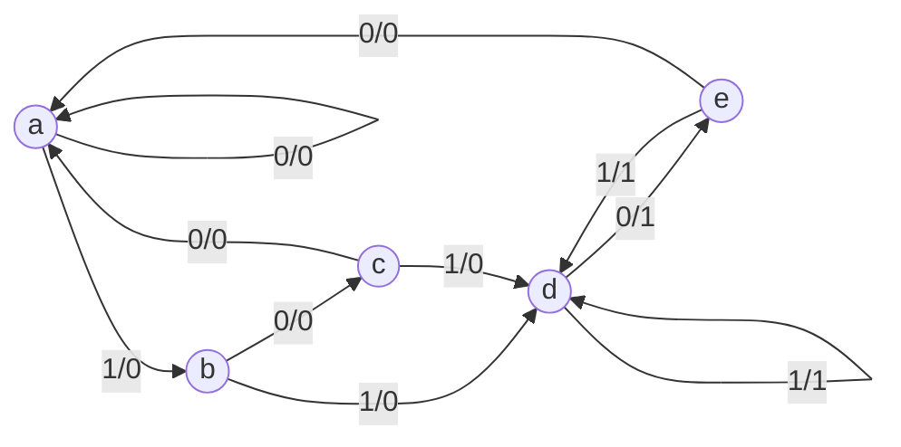

Links: [[VLSI]]
___

**Proceso para Minimización:**
1. Elaborar la Tabla de Estados
2. Observar si un Estado tiene las mismas Entradas Externas (Estado, Salida) *(Mealy)*
3. Se elimina uno de esos estados y se sustituye todas sus apariciones por el no eliminado
	- $X\space y \space Y$. Se elimina el renglón de $X$. Todas las apariciones de $X$ del lado derecho, se sustituyen por $Y$
4. Se repite el proceso hasta no tener estados iguales

___

En el proceso de diseño es importante considerar la reducción del costo del circuito.
Las reducciones se dan principalmente en el numero de flip-flops y de compuertas.
- Para reducir los flip-flops hay que reducir el numero de estados

___
Para reducir hay que identificar si existen estados equivalentes:
- Dos estados son equivalentes si para cada combinación de entradas dan las mismas salidas y envían el mismo estado (o uno equivalente)
- Cuando dos estados son equivalentes, uno de ellos puede eliminarse sin afectar el funcionamiento del circuito

___
# Efectos Minimización
Reducir el numero de estados no garantiza que se reduzca el numero de flip-flops necesarios
Reducir puede hacer que las funciones de activación de los flip-flops se vuelvan mas complejas, haciendo que crezca el bloque combinacional.

___
#### Ejemplo:
Estados: 7
Entradas: 1
Salidas: 1

**Tabla de Estados**

| Edo.Presente | x = 0 | x = 1 |
| ------------ | ----- | ----- |
| a            | a, 0  | b, 0  |
| b            | c, 0  | d, 0  |
| c            | a, 0  | d, 0  |
| d            | e, 0  | f, 1  |
| e            | a, 0  | f, 1  |
| f            | g, 0  | f, 1  |
| g            | a, 0  | f, 1  | 
Se observa que solamente $g$ y $e$, tienen los mismos valores.
Por ende, podremos eliminar el estado $g$ y sustituirlo por el estado $e$

| Edo.Presente | x = 0 | x = 1 |
| ------------ | ----- | ----- |
| a            | a, 0  | b, 0  |
| b            | c, 0  | d, 0  |
| c            | a, 0  | d, 0  |
| d            | e, 0  | f, 1  |
| e            | a, 0  | f, 1  |
| f            | <mark class="hltr-pink">e</mark>, 0  | f, 1  |
Una vez sustituido, se puede observar que ahora $d$ y $f$ son pares equivalentes
Se elimina a $f$ y se sustituye por $d$

| Edo.Presente | x = 0 | x = 1 |
| ------------ | ----- | ----- |
| a            | a, 0  | b, 0  |
| b            | c, 0  | d, 0  |
| c            | a, 0  | d, 0  |
| d            | e, 0  | <mark class="hltr-pink">d</mark>, 1  |
| e            | a, 0  | <mark class="hltr-pink">d</mark>, 1  
Esta es la tabla de estados mínima, ya no existen estados equivalentes.

**Modelo Reducido:**
Estados: 5
Entradas: 1
Salidas: 1

