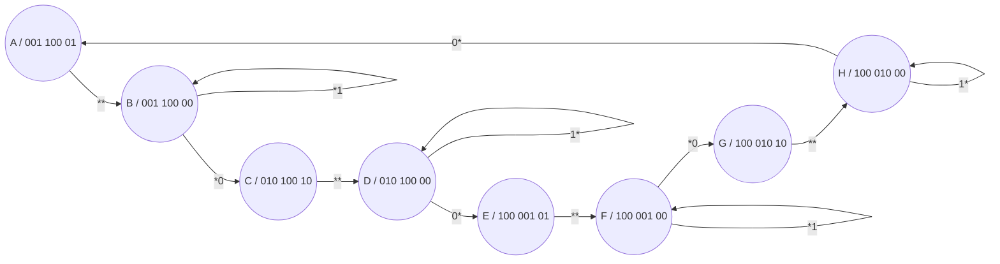

Links: [[VLSI]]
___

Tiempos de duracion de las luces:
- t_verde = 90 [s]
- t_amarillo = 5 [s]
- t_rojo = t_verde + t_amarillo = 95 [seg]

V1 → A1 → R1 → R2 → V1 …
R2 → R2 → V2 → A2 → R2 …
___
Entradas: 2 (T1 y T2)
Salidas: 8 (R1, A1, V1, R2, A2, V2, D1, D2)
Estados: 8

**Modelo de Moore:**

#### Tabla de transiciones
| Estado Presente | Entradas | Estado Siguiente | Salidas | Senales de Activacion |
| --- | --- | --- | --- | --- |
| 000 | 00 | 001 | 001 100 01 | 001 |
| 000 | 01 | 001 | 001 100 01 | 001|
|000 | 10 | 001 | 001 100 01| 001|
|000 | 11 | 001 | 001 100 01| 001|
| --- | --- | --- | --- | --- | ---|
| 001 | 00 | 010 | 001 100 00 | 011|
| 001 | 01 | 001 | 001 100 00 | 000|
|001 | 10 | 010 | 001 100 00| 011|
|001 | 11 | 001 | 001 100 00| 000|
| --- | --- | --- | --- | --- | ---|
| 010 | 00 | 011 | 010 100 10 | 001|
| 010 | 01 | 011 | 010 100 10 | 001|
|010 | 10 | 011 | 010 100 10| 001|
|010 | 10 | 011 | 010 100 10| 001|
| --- | --- | --- | --- | --- | ---|
| 011| 00 | 100 | 001 100 00 | 111|
| 011 | 01 | 100 | 001 100 00 | 111|
|011 | 10 | 011 | 001 100 00| 000| 
|011 | 10 | 011 | 001 100 00| 000|
| --- | --- | --- | --- | --- |---|
| 100 | 00 | 101 | 100 001 01 |001 |
| 100 | 01 | 101 | 100 001 01 | 001|
|100 | 10 | 101 | 100 001 01| 001|
|100 | 10 | 101 | 100 001 01| 001|
| --- | --- | --- | --- | --- |---|
| 101 | 00 | 001 | 001 100 01 | 011|
| 101 | 01 | 001 | 001 100 01 |000|
|101 | 10 | 001 | 001 100 01| 011|
|101 | 10 | 001 | 001 100 01| 000|
| --- | --- | --- | --- | --- | ---|
| 110 | 00 | 111 | 100 010 10 | 001|
| 110 | 01 | 111 | 100 010 10 | 001|
|110 | 10 | 111 | 100 010 10| 001|
|110 | 10 | 111 | 100 010 10| 001|
| --- | --- | --- | --- | --- | ---|
| 111 | 00 | 000 | 100 010 00 | 111|
| 111 | 01 | 000 | 100 010 00 | 111|
|111 | 10 | 111 | 100 010 00| 000|
|111 | 10 | 111 | 100 010 00| 000|
| --- | --- | --- | --- | --- |

- Las salidas no dependen de las entradas debido a que se esta diseñando en el modelo de Moore
- Por lo que los mapas de Karnaugh solo serán de 3 variables:
**Para V2:**

|e0/ e1 e2|00|01|11|10|
|---|---|---|---|---|
|0|0|1|0|0|
|1|0|1|0|0|
V2 = E1’ E2

**Para D1:**

|e0/ e1 e2|00|01|11|10|
|---|---|---|---|---|
|0|0|0|1|1|
|1|0|0|0|0|
D1 = E0’ E1

**R1**: E2
**A1**: E2' E1
**V1**: E2' E1'
**R2**: E2' 
**A2**: E2 E1
**V2**: E1' E2
**D1**: E1 E0'
**D2**: E1' E0'
**F2**: E1 E0 T1' 
**F1**: E1' E0 T2' + E1 E0 T1' 
**F0**: E0' + E1' E0 T2' + E1 E0 T1'