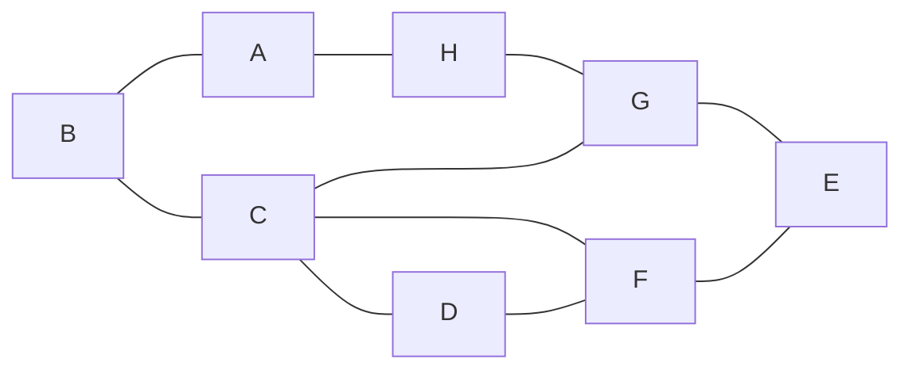

Links:
____

Miercoles 21 abril, no hay clase redes
# Enrutamiento
Proceso donde se trata de encontrar un camino entre dos puntos de la red: **nodo origen** y **nodo destino**

# Propiedades de los algoritmos
- **Corrección:** Se desea que el paquete llegue precisamente al nodo al que se envía
- **Simplicidad:** Debe aportar soluciones sencillas
- **Robustez:** Prever problemas
- **Estabilidad:** El procedimiento debe converger antes de que la red cambie de estado
- **Equidad o Justicia:** Debe tratar a todos los usuarios con la misma prioridad
- **Gestionabilidad (trazabilidad):** Contar con información para corregir problemas
	- **Trazabilidad:** Capacidad de rastrear todos los procesos realizados
- **Escalabilidad:** Debe tenerse un comportamiento optimo sin importar el numero de nodos

# Clasificación de Algoritmos de Enrutamiento

1. **Algoritmos No Adaptables, No Adaptativos o Estáticos**: Ya están configurados y no se pueden modificar
	- La decision de que ruta tomar de un nodo a otro, se calcula por adelantado
	- El administrador de la red configura manualmente la información acerca de las redes remotas

2. **Algoritmos Adaptables, Adaptativos o Dinámicos:**
	- Cambian sus decisiones de enrutamiento para reflejar los cambios de topología y de trafico

___
# Algoritmos de Enrutamiento

## Estáticos:
1. **Trayectoria, ruta o via mas corta**
	- Técnica de amplio uso
	- Sencilla y fácil de entender
	- Cada nodo representa un enrutador y cada arco del grafo una linea de comunicación (enlace)
	- Trayectoria mas corta entre enrutadores

- Este es un algoritmo estático, ya que los pesos de los arcos ya están preestablecidos

2. **Inundación**
	- Cada paquete de entrada se envía por cada una de las lineas de salida, excepto por la cual donde llego
	- Genera grandes cantidades de paquetes duplicados
	- Uso de un contador que disminuye en cada salto
	- El contador debe, idealmente, inicializarse a la longitud de la trayectoria

3. **Inundación Selectiva**
	- Los enrutadores no envían cada paquete de entrada por todas las líneas
	- Envían cada paquete por aquellas vias que van aproximadamente en la dirección correcta

## Dinámicos:
1. **Vector de distancia**
	- Cada enrutador cuenta con una tabla de la mejor distancia
	- Estas tablas se actualizan intercambiando información con vecinos
	- Tambien llamado algoritmo de enrutamiento Bellman-Ford o Ford-Fullkerson

2. **Estado de enlace**
	- Descubrir a sus vecinos y conocer sus direcciones de red
	- Medición del costo de la linea
	- Construcción de los paquetes de estado de enlace, se conoce el retardo a ese vecino
	- Distribución de los paquetes de estado de enlace.
		- A medida que se distribuyen e instalan los paquetes los enrutadores que reciban los primeros cambiaran sus rutas
	- Calculo de nuevas rutas

3. **Enrutamiento Jerarquico**
	- Los enrutadores se dividen en regiones
	- Cada enrutador conoce todos los detalles para entutar paquetes a destinos dentro de su propia region, pero no conoce la estructura interna de las otras regiones
	- Al interconectar diferentes redes, cada ruta es una region independiente

___
# Protocolos de Enrutamiento Dinámico
- Enrutamiento Interior (IGP)
	- Vector Distancia
		- RIP
			- RIPv2
		- IGRP
			- EIGRP
	- Estado de Enlace
		- OSPF
		- IS-IS
- Enrutamiento Exterior (EGP)
	- Vector Ruta
		- BGPv4

___
# Protocolos de Enrutamiento (Dinamicos)

Cada router es responsable de las maquinas directamente conectadas a el (incluyendo routers vecinos) y utiliza un mecanismo que permita a los routers comunicarse entre si, para evitar que cada uno tenga en sus tablas registros inválidos.
Esto se logra por medio de una serie de **protocolos de enrutamiento**.

-  **Protocolos IGP (*Interior Gateway Protocol*)**
	Comunicación entre los routers que se localizan dentro de la misma red

- **Protocolos EGP (*Exterior Gateway Protocol*)**
	Comunicación entre los routers que se localizan en distintas redes

## RIP (Protocolo de Información de Enrutamiento - *Routing Information Protocol*)
- Basado en el vector de distancia ya que calcula la métrica o ruta mas corta a partir del numero de "saltos"
- El limite máximo de saltos en RIP es de 15 (sin importar si es v1 o v2)
- Protocolo libre (lo reconoce cualquier dispositivo)
- RIPv1 no soporta VLSM ni CIDR
- RIPv2 soporta subredes, permitiendo VLSM y CIDR
- RIPng (*RIP next generation*) es para IPV6

## IGRP (Protocolo de Enrutamiento de Gateway Interior - *Interior Gateway Routing Protocol*)
- Desarrollado por Cisco System
- Se basa en el algoritmo vector de distancia
- Envía actualizaciones de las tablas de enrutamiento cada 90 segundos

## EIGRP (Protocolo de Enrutamiento de Gateway Mejorado - *Enhanced Interior Gateway Routing Protocol*)
- Protocolo mixto basado en IGRP
- Basado en vector de distancia
- Manda actualizaciones de las entradas de las tablas que han cambiado por haber sido alterado el estado de alguna maquina de su red
- Exclusivo de Cisco

## OSPF (Primera ruta mas corta - *Open Shortest Path First*)
- Protocolo puro de estado de enlace
- Calcula las rutas mar cortas y accesibles mediante el algoritmo de Dijkstra
- Maneja la construcción de un mapa de la red y el mantenimiento de bases de datos
- Cuando una maquina de su sistema cambia, se envía esa entrada de la tabla a los routers vecinos

## IS-IS (Sistema Intermedio a Sistema Intermedio - *Intermediate System to Intermediate System*)

- Protocolo de estado de enlace que básicamente maneja un mapa para enrutar paquetes mediante la convergencia de ka red
- Es mas común en grandes proveedores de servicios

## BGP (Protocolo de Puerta de Enlace de Frontera - *Border Gateway Protocol*)
- Intercambia información de encaminamiento entre sistemas autónomos (AS - *Autonomous Systems*) a la vez que garantiza una elección de rutas libres de bucles
- Es el protocolo principal de publicación de rutas utilizando por las compañías mas importantes de ISP en internet

___

