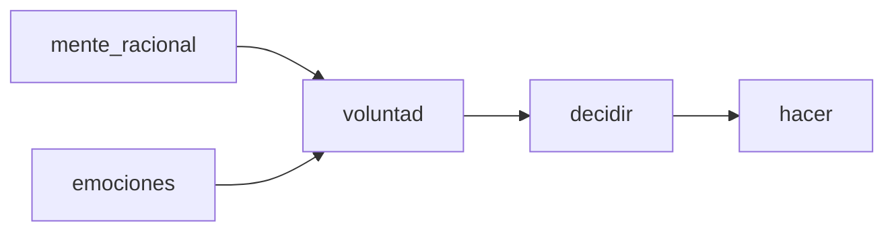

Links:
___
**Modelo de Persona:**

Psique + Sentidos <-- $\psi$cología

___
Las ideas de Aristoteles sobre la ética fueron manipuladas, posteriormente, por los religiosos cristianos.
Una de ellas fue las 4 virtudes naturales.:
- Mente $\rightarrow$ Prudencia
- Emociones:
	- + alegria, diversion (atractivas) $\rightarrow$ Templanza
	- - tristeza, enojo (repulsivas) $\rightarrow$ Fortaleza
- Voluntad $\rightarrow$ Justicia

Estas 4 conforman la ética de las virtudes de Aristoteles

Hay dos tipos de retroalimentación:
- Positiva
- Negativa

El **Modelo de Persona** es para un adulto promedio. No sirve:
- Para hablar del desarrollo
- Subconsciente
___
Pensamiento Ético - Kohlberg:
- Etapa preconvencional: castigo-premio
- Etapa convencional: espiritu de grupo - ley y el orden
- Etapa posconvencional: Principios universales

___
**Love Canal**

Participantes:
- Ejercito: Son responsables iniciales porque tiraron residuos tóxicos sin la precaución apropiada
- Hooker: Son aum mas responsables, porque hicieron lo mismo que el ejercito pero en mayores cantidades, además de que vendieron el terreno sin las medidas adecuadas ni alertar sobre lo que había en el terreno
- Junta Escolar: No hiceron los analisis adecuados para la construccion de una escuela y las viviendas
- Funcionarios de la ciudad: A pesar de los reclamos de los ciudadanos y las evidencias, no hicieron nada al respecto
- Occidental Chemical: No son responsables del daño ambiental.

**Atributos**
- Ejercito: No hubo prudencia ni justicia
- Hooker: No hubo presencia, justicia,
- Junta Escolar: Hubo templanza porque querían construir algo positivo, pero no hubo prudencia al no analizar el suelo
- Funcionarios de la ciudad: 
- Occidental Chemical: Si hubo justicia, prudencia, empatía, fortaleza y templanza. Hicieron algo bueno por los habitantes a pesar de los costos que le implicarían a la empresa

